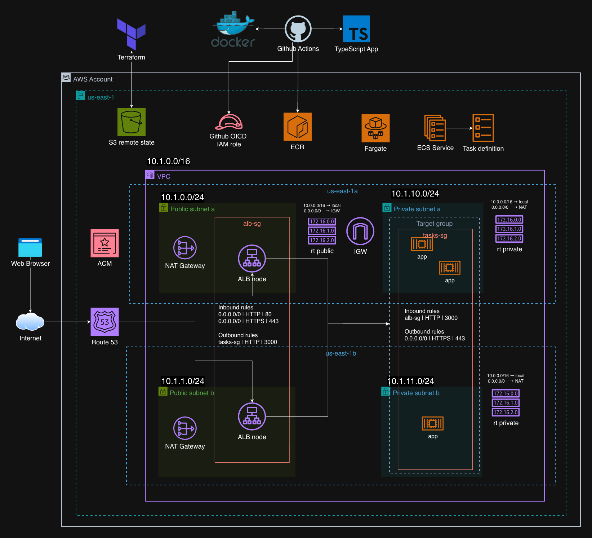

# API Express en ECS Fargate con ALB

Proyecto de aprendizaje para desplegar una API stateless de Express en AWS. La aplicación se distribuye como una imagen Docker y se ejecuta en ECS Fargate detrás de un Application Load Balancer (ALB); Terraform administra la infraestructura.

GitHub Actions construye y publica la imagen en Amazon ECR. El despliegue se mantiene manual para poder revisar el plan de Terraform antes de aplicar cada cambio.

## Arquitectura

<p align="center">
  
</p>

```text
push a main → GitHub Actions → ECR → Terraform → ALB → ECS Fargate
```

- El ALB está en dos subnets públicas.
- Las tareas Fargate están en dos subnets privadas y no tienen IP pública.
- Cada zona de disponibilidad tiene un NAT Gateway.
- El ALB comprueba la salud de las tareas mediante `GET /health`.
- ECS escala el servicio para mantener un promedio de CPU cercano al 60 %.
- CloudWatch recibe los logs y Container Insights está habilitado.

## Entornos

| Configuración    | Desarrollo                      | Producción                       |
| ---------------- | ------------------------------- | -------------------------------- |
| Root module      | `infra/env/dev`                 | `infra/env/prod`                 |
| CIDR de VPC      | `10.20.0.0/16`                  | `10.1.0.0/16`                    |
| Acceso público   | HTTP :80                        | HTTPS :443; :80 redirige a :443  |
| DNS              | DNS generado por el ALB         | Alias en Route 53                |
| Tareas mín./máx. | 2 / 6                           | 4 / 8                            |
| Imagen           | Se recomienda usar digest       | El digest SHA-256 es obligatorio |
| Estado S3        | `ecs-alb/dev/statefile.tfstate` | `ecs-alb/prod/statefile.tfstate` |

La misma imagen validada en desarrollo se promueve a producción; no se vuelve a construir.

## Estructura

```text
.
├── .github/workflows/deploy.yml  # Publicación de la imagen
├── app/                          # API, pruebas y Dockerfile
├── docs/architecture.png         # Diagrama
└── infra/
    ├── env/dev/                  # Configuración de desarrollo
    ├── env/prod/                 # Configuración de producción
    └── modules/web-stack/        # ALB, ECS, IAM, logs y autoscaling
```

## API

| Método | Ruta                        | Respuesta                                   |
| ------ | --------------------------- | ------------------------------------------- |
| `GET`  | `/health`                   | Estado usado por el health check del ALB    |
| `GET`  | `/`                         | Nombre, versión, entorno y host de la tarea |
| `GET`  | `/api/hello?name=Terraform` | Saludo, versión, entorno, host y fecha      |

## Requisitos

Herramientas locales:

- Terraform `>= 1.10, < 2.0`
- AWS CLI v2 con credenciales configuradas
- Docker con Buildx
- Node.js 22 o posterior y Corepack/pnpm

Recursos que deben existir en `us-east-1`:

1. Un bucket S3 para el estado de Terraform, con versionado, cifrado y acceso restringido.
2. Un repositorio ECR privado llamado `ecs-alb-api`; se recomiendan tags inmutables y escaneo de imágenes.
3. Un proveedor OIDC de GitHub y un IAM role que pueda publicar en ese repositorio.
4. Para producción, una hosted zone pública de Route 53 y un certificado ACM en estado `ISSUED` que cubra el dominio elegido.

> [!WARNING]
> Este laboratorio genera costes por los NAT Gateways, el ALB, las tareas Fargate, CloudWatch y la transferencia de datos. Destruye los entornos cuando termines de usarlos.

## Probar la aplicación localmente

Desde la raíz del repositorio:

```bash
cd app
corepack enable
pnpm install --frozen-lockfile
pnpm typecheck
pnpm test
pnpm dev
```

En otra terminal:

```bash
curl --fail http://127.0.0.1:3000/health
curl --fail 'http://127.0.0.1:3000/api/hello?name=Terraform'
```

Para probar la misma arquitectura de imagen que usa ECS:

```bash
docker buildx build --platform linux/amd64 --tag ecs-alb-api:local --load app
docker run --rm --platform linux/amd64 --publish 3000:3000 \
  --env APP_ENV=local --env APP_VERSION=local ecs-alb-api:local
```

La Task Definition usa Linux `X86_64`; por eso la imagen se construye para `linux/amd64`, incluso desde un equipo ARM64.

## Desplegar

### 1. Publica la imagen

El workflow [`.github/workflows/deploy.yml`](.github/workflows/deploy.yml) se ejecuta manualmente o con un push a `main` que modifique `app/**` o el propio workflow.

Configura estos secrets en GitHub Actions:

| Secret             | Contenido                          |
| ------------------ | ---------------------------------- |
| `AWS_ACCOUNT_ID`   | ID de la cuenta AWS autorizada     |
| `AWS_DEV_ROLE_ARN` | ARN del role asumido mediante OIDC |

La trust policy del role debe aceptar `https://token.actions.githubusercontent.com`, exigir el audience `sts.amazonaws.com` y limitar el claim `sub` a este repositorio y a `refs/heads/main`. El role necesita `ecr:GetAuthorizationToken` sobre `*` y `ecr:BatchCheckLayerAvailability`, `ecr:CompleteLayerUpload`, `ecr:InitiateLayerUpload`, `ecr:PutImage` y `ecr:UploadLayerPart` únicamente sobre el ARN de `ecs-alb-api`.

Al terminar, el Job Summary muestra los dos valores que necesita Terraform:

```text
Immutable URI: 123456789012.dkr.ecr.us-east-1.amazonaws.com/ecs-alb-api@sha256:...
App version:   f7691c1b6583180acd338b1c1bd26ba0ed59e87a
```

### 2. Despliega desarrollo

Crea el archivo local de variables y reemplaza sus valores con el resultado del workflow:

```bash
cp infra/env/dev/terraform.tfvars.example infra/env/dev/terraform.tfvars
```

```hcl
container_image = "123456789012.dkr.ecr.us-east-1.amazonaws.com/ecs-alb-api@sha256:..."
app_version     = "f7691c1b6583180acd338b1c1bd26ba0ed59e87a"
```

`terraform.tfvars` está ignorado por Git y no debe contener credenciales. Inicializa el backend con el bucket S3 existente y despliega:

```bash
terraform fmt -check -recursive infra
terraform -chdir=infra/env/dev init -backend-config="bucket=nombre-globalmente-unico-del-bucket"
terraform -chdir=infra/env/dev validate
terraform -chdir=infra/env/dev plan -out=/tmp/ecs-alb-dev.tfplan
terraform -chdir=infra/env/dev apply /tmp/ecs-alb-dev.tfplan
```

Comprueba el servicio:

```bash
DEV_URL="$(terraform -chdir=infra/env/dev output -raw application_url)"
curl --fail "${DEV_URL}/health"
curl --fail "${DEV_URL}/api/hello?name=Terraform"
```

### 3. Promueve a producción

Reutiliza exactamente el `container_image` por digest y el `app_version` validados en desarrollo:

```bash
cp infra/env/prod/terraform.tfvars.example infra/env/prod/terraform.tfvars
```

```hcl
container_image = "123456789012.dkr.ecr.us-east-1.amazonaws.com/ecs-alb-api@sha256:..."
app_version     = "f7691c1b6583180acd338b1c1bd26ba0ed59e87a"
certificate_arn = "arn:aws:acm:us-east-1:123456789012:certificate/..."
domain_name     = "api.example.com"
route53_zone_id = "Z0123456789ABCDEFGHIJ"
```

El certificado debe estar en la misma región del ALB y `domain_name` debe pertenecer a la hosted zone indicada.

```bash
terraform -chdir=infra/env/prod init -backend-config="bucket=nombre-globalmente-unico-del-bucket"
terraform -chdir=infra/env/prod validate
terraform -chdir=infra/env/prod plan -out=/tmp/ecs-alb-prod.tfplan
terraform -chdir=infra/env/prod apply /tmp/ecs-alb-prod.tfplan

PROD_URL="$(terraform -chdir=infra/env/prod output -raw application_url)"
curl --fail "${PROD_URL}/health"
```

## Comportamiento operativo y seguridad

- Una imagen o versión nueva registra una revisión de la Task Definition y activa un rolling deployment.
- El circuit breaker de ECS revierte un despliegue que no llegue a estar saludable.
- Los logs se conservan 30 días en CloudWatch Logs.
- Solo el Security Group del ALB puede acceder al puerto 3000 de las tareas.
- El contenedor se ejecuta como usuario no root.
- GitHub Actions usa credenciales temporales mediante OIDC.
- El backend cifra el estado y usa el locking nativo de S3.
- Los roles de ejecución y de tarea de ECS están separados.

## Destruir un entorno

Revisa primero el plan de destrucción:

```bash
terraform -chdir=infra/env/dev plan -destroy
terraform -chdir=infra/env/dev destroy
```

Usa `infra/env/prod` para producción. El bucket del backend, el repositorio ECR y sus imágenes no forman parte de estos root modules y no se eliminan con `terraform destroy`.
